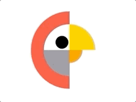

# BirdLoader
A preloader with simple geometric shapes that reminds me of a birdy turning its head and talking to someone.:bird:

### Introduction
This design is inspired by Jeroen Van Eerden from one his Dribbble shots [here](https://dribbble.com/shots/2028906-Birds). It is highly configurable and allows you to design the bird as you wish. Try out different colors on this and let me know how it turns out for you. This would be a nice fit for preloading on websites or apps featuring businesses in the TV, radio or social media industry.:tv:

### What it looks like?
**Left Facing** | **Right Facing**
------------------- | ---------------------
 | 

### Configurables
1. **hairColor**: Color of the chicken's hair.
2. **forehead**: Color of the chicken's forehead.
3. **beardColor**: Color of the chicken's beard.
4. **beakColor**: Color of the chicken's beak.
5. **mouthColor**: Color of the chicken's mouth.
6. **eyeColor**: Color of the chicken's eye.
7. **startDirection**: Determines the chicken's initial face direction.
8. **duration**: Total animation duration.

### How to use
``` 
// initialize properties
let loaderProperties: BirdLoader.Properties = .init(
    hairColor: .systemRed,
    foreheadColor: .white,
    beardColor: .systemGray,
    beakColor: .systemYellow,
    mouthColor: .systemOrange,
    eyeColor: .black,
    startDirection: .facingRight,
    duration: 0.4
)

// initialize loader
let loader: BirdLoader = .init(properties: loaderProperties)

// add loader and set constraints
view.addSubview(loader)
loader.centerXAnchor.constraint(equalTo: view.centerXAnchor).isActive = true
loader.centerYAnchor.constraint(equalTo: view.centerYAnchor).isActive = true
loader.widthAnchor.constraint(equalToConstant: 150).isActive = true
loader.heightAnchor.constraint(equalToConstant: 150).isActive = true
```
That's it!:exploding_head:You can set a custom width and height for this as well and it'll adapt to the size of its parent view.

As soon as you add loader to the parent view, it'll start animating. To stop the loading animation, just call `loader.stopLoading()`.

### Show some appreciation
Hey if you like this project and consider using it in your app, I'd like if you give it a star and show some love.:star::heavy_heart_exclamation:
